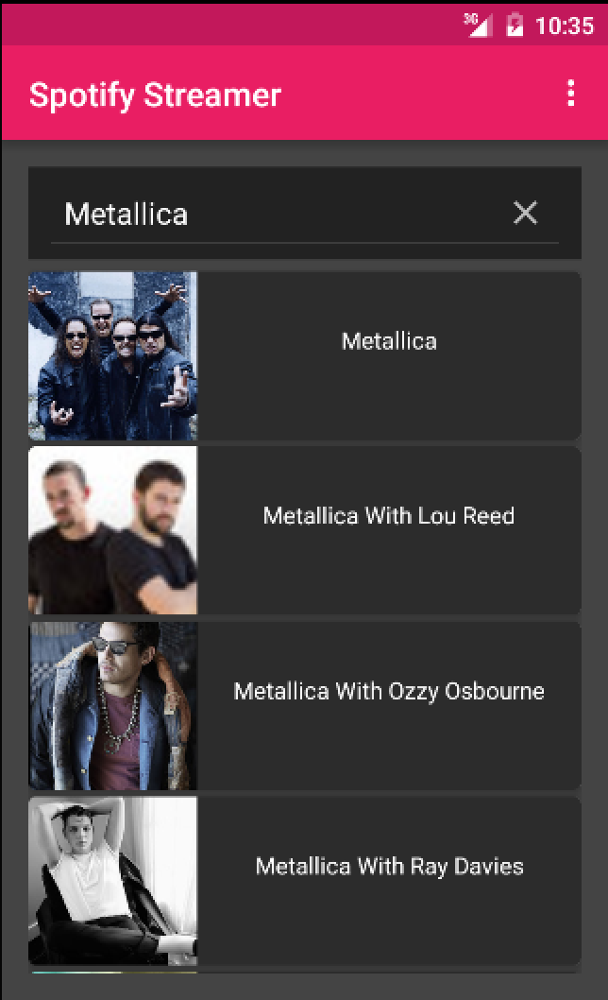
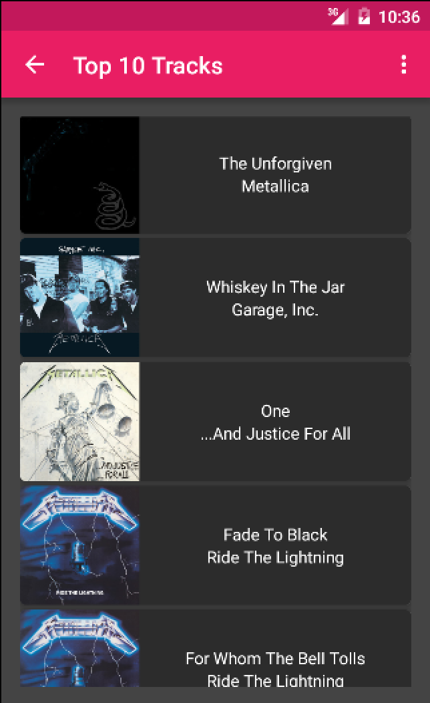
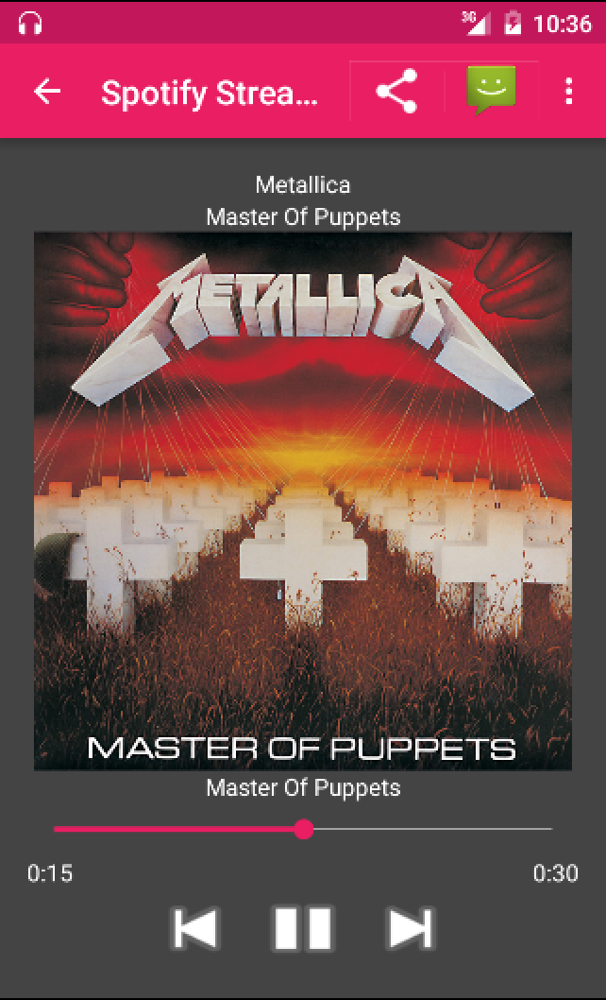
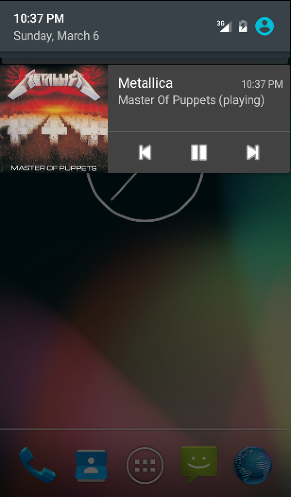
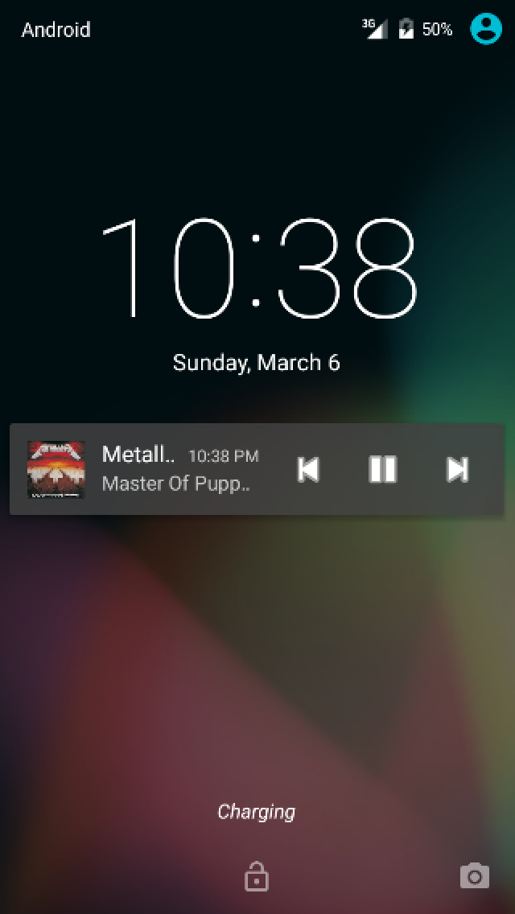

# Udacity Spotify streamer
This is an android project for the Udacity Android Developer Nanodegree, this application uses the Spotify API to search artists and get top tracks, play preview songs and show controls in notification and lock screen. 

## Install
1. Install Android Studio, make sure that the Android SDK Tools are properly installed.
2. Download or clone this repository and import it into Android Studio.
3. Compile and run.

## Screenshots

## License
The content of this repository is licensed under a [Apache License, Version 2.0](http://www.apache.org/licenses/LICENSE-2.0)
